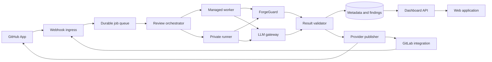

# Guardener platform architecture

Status: target architecture for MVP delivery
Audience: platform, backend, infrastructure, security, and frontend engineering

## Architectural decision

The current one-shot Rust CLI remains the deterministic execution primitive.
The product adds a service around it rather than turning each CLI invocation
into an independent source of product state.

The architecture has three planes:

1. **Integration plane:** authenticates provider events and maps GitHub and
   GitLab into shared contracts.
2. **Control plane:** owns tenants, policy, jobs, findings, usage, audit, and the
   website API.
3. **Execution plane:** leases bounded jobs to managed ephemeral workers or
   customer-hosted private runners.

Those planes are logical, not a mandate that Guardener operates them. Cloud
runs all three as a managed multi-tenant service. Hybrid keeps the control plane
in Cloud and moves execution into the customer network. Guardener Community
runs all three as a free single-organization deployment inside the customer's
network and calls only the model endpoint the operator configures.



The LLM gateway is a bounded call, not an autonomous write-capable agent. Only
the provider publisher holds comment/status capability, and it accepts validated
normalized results rather than arbitrary model tool calls.

The first Community topology reuses the same components in one supported
deployment unit plus a database. It does not introduce a second scheduler,
contract, or review engine. Splitting that unit for high availability belongs
to Enterprise Self-Hosted, not the initial free package.

## Deployment profiles

| Profile | Control plane | Execution | Model route | Primary fit |
|---|---|---|---|---|
| Community | Customer network, single organization, signed proprietary package under a no-cost license | Local worker | Customer-supplied compatible endpoint | Free adoption, private repos, VPN-only Git hosts, local models |
| Cloud | Guardener-managed | Managed ephemeral worker | Guardener-approved managed route | Lowest operational burden |
| Hybrid | Guardener-managed | Outbound-only private runner | Customer-approved local or external route | Source/dependency access must remain private |
| Enterprise Self-Hosted | Customer network under a supported commercial topology | Customer-managed pools | Customer-approved, including offline models | HA, air-gap, advanced identity/audit, support |

All profiles implement the same `ReviewJob`, `Finding`, `AnalysisResult`, and
`RepositoryPolicy` contracts. Export/import can move policy and normalized
non-source metadata between profiles; credentials are always re-entered at the
destination.

## Repository ownership and codebase topology

Deployment profiles are not source-code forks. The product uses two repository
boundaries:

| Repository boundary | License/access | Owns | Must not own |
|---|---|---|---|
| Current `suiflex/Guardener` repository | Existing MIT license; repository visibility is an independent operational choice | One-shot Rust CLI, ForgeGuard integration, deterministic analysis, and reusable analyzer entry points | Proprietary control plane, dashboard, entitlement, or hosted-service implementation |
| Future `guardener-platform` monorepo | Private proprietary source | Control plane, web application, orchestrator/publisher, GitHub/GitLab service adapters, LLM gateway, private-runner protocol/runtime, entitlements, and deployment definitions | A forked copy of deterministic rules already owned by Guardener/ForgeGuard |

The private platform monorepo builds Community, Cloud, Hybrid, and Enterprise
Self-Hosted from the same tagged source and contracts. Community is a signed
free-to-use proprietary artifact; distributing its image or binary does not
grant access to the platform repository. The platform consumes a pinned
Guardener/ForgeGuard library or binary and preserves its MIT notices.

A conceptual monorepo layout is sufficient to preserve ownership without
premature service repositories:

```text
guardener-platform/
  apps/control-plane
  apps/web
  apps/worker
  apps/runner
  crates/contracts
  crates/scm-github
  crates/scm-gitlab
  crates/model-gateway
  deploy/community
  deploy/cloud
  deploy/hybrid
  deploy/enterprise
```

Directory names may change during implementation; the boundary does not. There
is one provider implementation and one review contract. Deployment-specific
configuration and entitlement select a profile, while shared behavior remains
covered by the same contract tests. Long-lived Community, Cloud, or Hybrid
branches are prohibited because they would turn deployment differences into
product drift.

A component moves to another repository only after evidence shows at least one
real boundary: a separate security/access domain, independent ownership and
release cadence, incompatible build toolchain, or measured scaling need. Until
then, another repository adds coordination without improving isolation.

## Component responsibilities

| Component | Owns | Does not own |
|---|---|---|
| Webhook ingress | Raw-body authentication, replay window, delivery receipt, normalization request, fast acknowledgement | Analysis or provider comments |
| SCM adapter | Provider API authentication, event mapping, diff/metadata fetch, position mapping, provider writes | Product policy or model judgment |
| Review orchestrator | Debounce, job identity, queueing, cancellation, lease, retry, current-head checks | Source execution |
| Managed worker | Ephemeral checkout, deterministic scan, bounded context collection, model request, cleanup | Tenant policy changes or provider writes |
| Private runner | Same analysis contract inside customer infrastructure | Dashboard state or long-lived control-plane credentials |
| Community deployment | Local integration, control, execution, provider publication, basic dashboard, upgrade/export interfaces | Guardener Cloud dependency or enterprise HA orchestration |
| ForgeGuard | Deterministic findings and policy outcome | LLM findings or provider-specific rendering |
| LLM gateway | Approved provider/model routing, prompt version, budgets, timeout, schema response | Merge status or direct SCM access |
| Result validator | Schema, bounds, secret scan, path/line validation, fingerprint, stale check | Guessing an invalid inline location |
| Provider publisher | Idempotent status, summary, inline comments, update/resolve behavior | Reinterpreting findings |
| Dashboard API | Authorized tenant views and administration | Source-code storage |

All GitHub API calls in the current CLI remain in `src/github.rs`. The future
service introduces provider adapters in its own implementation boundary; it
must not scatter new GitHub or GitLab HTTP calls through analysis code.

## Shared contracts

These are logical contracts. The implementation may encode them as versioned
JSON, database rows, and Rust types, but the field meanings remain stable.

### ReviewJob

| Field | Meaning |
|---|---|
| `contract_version` | Version of the job/result wire contract |
| `job_id` | Guardener-generated immutable identifier |
| `tenant_id` | Authorization and billing boundary |
| `deployment_profile` | `community`, `cloud`, `hybrid`, or `enterprise_self_hosted`; changes routing and operations, never finding authority |
| `provider` | `github` or `gitlab` |
| `provider_host` | GitHub host or GitLab instance; validated against the integration |
| `repository_id` | Stable provider repository/project identity |
| `change_number` | PR number or MR IID |
| `base_sha`, `head_sha` | Exact comparison under review |
| `delivery_id` | Provider delivery identity used for replay detection |
| `trigger` | `open`, `reopen`, `head_update`, `manual_retry`, `scheduled_full_scan`, or `outbound_reconcile` |
| `policy_version` | Immutable policy snapshot used by the job |
| `execution_route` | Managed pool or private-runner group |
| `limits` | File, byte, line, duration, token, and output bounds |
| `created_at`, `not_before` | Receipt and debounce timestamps |

Uniqueness is `(tenant_id, provider, repository_id, change_number, head_sha,
policy_version, trigger_class)`. Repeated delivery updates the receipt audit but
does not create duplicate work.

### Finding

| Field | Meaning |
|---|---|
| `finding_id` | Guardener identity for one lifecycle |
| `fingerprint` | Stable hash of origin, rule/prompt family, normalized path, code location/symbol, and issue identity |
| `origin` | `deterministic` or `llm` |
| `producer_version` | ForgeGuard/rule version or prompt/model version |
| `severity` | Origin-specific priority, never implicit merge authority |
| `path`, `start_line`, `end_line`, `side` | Normalized location, optional until validated |
| `title`, `explanation`, `evidence`, `suggestion` | Validated display content; raw source/diff excerpts are not persisted |
| `policy_effect` | Deterministic-only result: `none`, `warn`, or `block` |
| `disposition` | `open`, `fixed`, `accepted`, `suppressed`, `invalid`, or `stale` |
| `provider_refs` | Comment/thread/status identities already published |

The fingerprint intentionally excludes prose wording so a model rephrasing the
same issue does not create a new thread.

### AnalysisResult

| Field | Meaning |
|---|---|
| `contract_version`, `job_id`, `head_sha`, `policy_version` | Correlate result with the leased job |
| `worker_id`, `analyzer_version` | Execution provenance |
| `deterministic_status` | `passed`, `failed`, `skipped`, or `error` |
| `advisory_status` | `completed`, `empty`, `skipped`, or `error` |
| `findings` | Validated candidates before provider publication |
| `bounds` | Actual files, lines, bytes, duration, and model tokens consumed |
| `cleanup_attestation` | Worker statement that ephemeral workspace disposal completed |
| `errors` | Redacted stage failures with stable codes |

### RepositoryPolicy

The policy includes automatic-review enablement, path exclusions, ForgeGuard
mode/rule exceptions, full-scan schedule, execution route, diff/model bounds,
and notification preferences. It cannot grant LLM findings a blocking effect.
Organization defaults and repository overrides compile into an immutable policy
snapshot before a job is queued.

## Event and job flow

Cloud prefers authenticated webhooks. A Community instance that cannot accept
inbound provider traffic may use bounded outbound polling/reconciliation. That
adapter persists a cursor, fetches only selected repositories, normalizes the
same lifecycle events, and enters the flow below after authentication. It trades
immediacy and provider API quota for a no-inbound deployment; it does not change
job identity or publication safety.

1. Receive the raw webhook body and required headers.
2. Resolve the integration from host and installation/project identity.
3. Verify the signature/token in constant time before parsing trusted fields.
4. Reject stale signed timestamps where the provider supports them.
5. Insert the delivery receipt using the provider delivery ID as an idempotency
   key.
6. Return success within the provider deadline after durable receipt, not after
   analysis. GitHub instructs receivers to return a 2xx response within ten
   seconds: [Handling webhook deliveries](https://docs.github.com/en/webhooks/using-webhooks/handling-webhook-deliveries).
7. Normalize only eligible lifecycle events. Metadata-only updates that do not
   change head, base, draft eligibility, or policy are audited and ignored.
8. Upsert a debounce record for the change. A newer head cancels queued older
   jobs and marks running older jobs unable to publish.
9. Lease to the configured execution route with a short-lived job credential.
10. Fetch the exact base/head, run ForgeGuard, gather bounded relevant context,
    call the LLM gateway, validate results, and submit an `AnalysisResult`.
11. Re-fetch the current provider head and policy before every provider write.
12. Publish deterministic status first, then advisory summary/inline findings.
13. Record individual write outcomes; retry only failed idempotent operations.
14. Destroy the workspace and expire code-bearing transient objects.

## GitHub adapter

The MVP uses a dedicated Guardener Cloud GitHub App. Required capabilities are
derived from endpoints during implementation; expected repository permissions
are Pull requests read/write, Checks read/write, and Contents read. No broader
permission is requested without a documented endpoint.

- Subscribe to the `pull_request` event for open, reopen, synchronize, close,
  and relevant draft transitions. GitHub requires at least Pull requests read
  permission for the event: [Webhook events and payloads](https://docs.github.com/en/webhooks/webhook-events-and-payloads#pull_request).
- Verify `X-Hub-Signature-256` over the raw payload before work:
  [Validating webhook deliveries](https://docs.github.com/en/webhooks/using-webhooks/validating-webhook-deliveries).
- Use the delivery GUID plus normalized event identity for idempotency. Because
  GitHub does not automatically redeliver failed webhooks, operate a bounded
  reconciliation process over failed App deliveries:
  [Handling failed webhook deliveries](https://docs.github.com/en/webhooks/using-webhooks/handling-failed-webhook-deliveries).
- Create deterministic check runs and annotations through the Checks API:
  [REST API endpoints for checks](https://docs.github.com/en/rest/checks).
- Create LLM inline feedback with the latest `commit_id`, `path`, `line`, and
  `side`; do not use the closing-down `position` parameter:
  [Create a pull-request review comment](https://docs.github.com/en/rest/pulls/comments#create-a-review-comment-for-a-pull-request).

Today's GitHub App remains webhook-disabled until this future App and migration
are separately implemented. Combining them would unnecessarily carry current
hygiene write permissions into the SaaS review path.

## GitLab adapter

The MVP supports GitLab.com first within the GitLab adapter contract, while
retaining `provider_host` for later self-managed compatibility. Sign-in and
delegated access use a GitLab OAuth application; onboarding installs project or
group webhooks only where the administrator has authority.

GitLab documents `read_repository` as read-only source access and `api` as
broad API read/write access. Because MVP must create MR discussions and commit
statuses, the integration uses `api` and makes that broader grant explicit
during onboarding. The adapter still restricts its own operation allowlist to
selected projects and required endpoints. A narrower credential model is
revisited if GitLab exposes sufficient fine-grained write permissions for all
supported offerings. Official scope reference:
[GitLab OAuth scopes](https://docs.gitlab.com/integration/oauth_provider/#view-all-authorized-applications).

- Merge request events cover creation, updates, reopen, and commits added to
  the source branch: [GitLab merge request events](https://docs.gitlab.com/user/project/integrations/webhook_events/#merge-request-events).
- Prefer GitLab signing tokens and verify the Standard Webhooks HMAC, timestamp,
  and `webhook-id`; retain `Idempotency-Key` compatibility:
  [GitLab webhooks](https://docs.gitlab.com/user/project/integrations/webhooks/#signing-tokens).
- Create deterministic commit pipeline status through the Commits API. External
  status checks are not the universal MVP mechanism because GitLab documents
  them as an Ultimate-tier feature:
  [Set commit pipeline status](https://docs.gitlab.com/api/commits/#set-commit-pipeline-status) and
  [External status checks](https://docs.gitlab.com/user/project/merge_requests/status_checks/).
- Create inline threads with the current base/start/head SHAs and old/new
  paths/lines:
  [Create a merge-request diff thread](https://docs.gitlab.com/api/discussions/#create-a-new-thread-in-the-merge-request-diff).

The adapter must refresh expiring OAuth tokens, surface authorization failures,
and isolate credentials by GitLab host and tenant.

## Context selection

The full deterministic scan and the model review have different input shapes:

- ForgeGuard sees the checked-out repository and exact comparison. Managed
  workers disable repository-configured commands; static parsing is allowed.
- The model sees PR/MR title and description, normalized diff, applicable
  engineering guidance, deterministic finding summaries to avoid duplication,
  and bounded symbol/file context selected by deterministic references.
- Repository history, issue text, or cross-repository context is absent from
  MVP unless explicitly authorized and covered by the same retention rules.

This borrows the useful concept of context-aware automatic review demonstrated
by [CodeRabbit](https://www.coderabbit.ai/) without adopting unrestricted agent
access or model-driven writes.

## Storage and retention

| Data class | Persistent? | Rule |
|---|---:|---|
| Raw webhook body | Short transient only | Retain only through authentication/replay window, then discard or irreversibly redact |
| Source checkout and diff | No | Ephemeral worker workspace; delete after terminal job |
| Code-bearing prompt/response | No | Process transiently; structured redacted result only |
| Findings and locations | Yes | Tenant-configured metadata retention; no source body |
| Job metadata and bounds | Yes | Needed for reliability, usage, and audit |
| Provider comment/status references | Yes | Needed for idempotent updates |
| Policy and audit events | Yes | Append-only logical history with retention controls |
| Secrets and tokens | Yes, encrypted | Dedicated secret store; never copied into job payloads beyond short-lived scoped credentials |

In Community, “tenant” still means the local authorization boundary even though
there is one organization and no Guardener billing account. Provider and model
secrets remain in the operator's secret boundary. The instance must start and
run reviews with all Guardener service domains unreachable; update checks and
anonymous telemetry are independent opt-ins.

Backups inherit the same data classes. Deletion must remove tenant metadata and
encrypted credentials from active stores, then expire them from backups under a
documented schedule.

## Failure handling

| Failure | Behavior |
|---|---|
| Invalid webhook authentication | Reject, increment security metric, no receipt/job |
| Duplicate delivery | Return success with existing receipt, no duplicate job |
| Provider rate limit | Respect provider retry guidance, retain current-head job, show delayed state |
| New head during analysis | Mark old job stale; never publish its result |
| Worker lease expires | Retry within attempt bound; reject late duplicate result |
| ForgeGuard error | Deterministic status error; LLM may be skipped, never convert error to pass |
| Model timeout/malformed output | Keep deterministic result; advisory result error with no model text published |
| Invalid inline position | Keep finding in summary/dashboard, no guessed inline comment |
| Partial provider publication | Record each write, retry missing idempotent writes, never repost completed ones |
| Private runner offline | Queue within bounded age or fail visibly; no silent cloud fallback |
| Community model endpoint unavailable | Preserve deterministic result, fail advisory review visibly, and never fall back to Guardener or another provider |
| Community instance loses database | Stop provider writes until state is restored; do not reconstruct idempotency from guesses |
| Integration revoked | Reject new jobs, stop writes, cancel leases, begin credential/deletion workflow |

## Observability

Required signals are webhook authentication failures, receipt latency,
duplicate rate, queue age, job stage duration, lease expiry, cancellation/stale
rate, provider API status/rate limits, publication retries, model latency/tokens,
schema failures, finding dispositions, worker cleanup failures, and runner
version/capacity.

Logs and traces carry tenant/job/provider IDs and stable error codes. They do not
carry repository source, diff hunks, prompts, model raw output, tokens, or secret
headers.

## Evolution boundary

The MVP deliberately excludes a general autonomous agent, automatic fixes,
issue-tracker retrieval, cross-repository semantic graphs, post-merge actions,
and multi-node Community orchestration. These ideas may be evaluated after the
review loop is reliable; none is required to deliver the product promise in
[product direction](00-product-direction.md).
